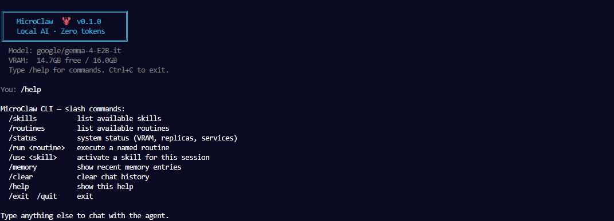

# MicroClaw

> A local-first, voice-native, skill-compatible AI agent powered by Gemma 4 E2B-it.  
> Smaller than NanoClaw. Zero cloud. Zero token cost. Runs on the edge.



## Quick Start

### Direct (recommended for first run)

```bash
git clone https://github.com/fabiopacifici-bot/microclaw
cd microclaw
pip install fastapi uvicorn pyyaml requests sounddevice psutil transformers>=5.5.0 accelerate
./microclaw
```

Type a message — the model loads on first input (~30-60s). Subsequent responses are fast.

### Docker (no Desktop required)

```bash
# Start Docker in WSL2 without Docker Desktop
sudo dockerd &

# API server mode
docker compose up -d microclaw

# Interactive CLI
docker compose --profile cli run --rm microclaw-cli
```

See [docs/DOCKER.md](docs/DOCKER.md) for GPU passthrough setup and model mounting.

### CLI commands

```
./microclaw            # start chat
./microclaw /skills    # list available skills
./microclaw /routines  # list available routines
./microclaw /status    # VRAM + system info
```

Inside chat:
```
/skills       list skills
/routines     list routines
/run <name>   execute a routine
/memory       show last 5 exchanges
/status       system info
/help         all commands
/exit         quit
```

### Requirements

- Python 3.11+
- CUDA GPU 10GB+ VRAM recommended (CPU fallback available)
- Gemma 4 E2B-it model — set `model.path` in `config.yaml` or let it auto-download via HuggingFace

---

## Vision

Modern AI agents are expensive to run. Every message, every routine check, every heartbeat consumes cloud tokens. MicroClaw solves this by running a capable, voice-native agent entirely locally — on a laptop, a Raspberry Pi, or a Docker container — using Google's Gemma 4 E2B, a 2.3B effective parameter model with native audio support.

MicroClaw is not a replacement for cloud agents. It is the **local tier** in a multi-agent hierarchy:

```
Cloud Agent (Olly / Claude / GPT)     ← complex reasoning, long tasks
       ↕ delegation protocol
NanoClaw / OpenClaw                   ← orchestration, multi-channel
       ↕ sub-agent registration
MicroClaw (Gemma 4 E2B)               ← local, voice, edge, zero cost
```

90% of what an assistant does daily — running routines, checking services, reading files, executing tool calls, delivering briefings — does not require a frontier model. MicroClaw handles that layer so the expensive models only touch the work that actually needs them.

---

## Core Principles

**1. Local-first, always**  
MicroClaw runs entirely on the host machine. No API keys. No cloud dependency. No token cost. Works offline.

**2. Voice-native**  
Gemma 4 E2B handles audio input and audio output natively — no separate Whisper STT or TTS pipeline. One model, one round trip, lower latency.

**3. Skills & Routines compatible**  
Reads and executes `SKILL.md` and `ROUTINE.md` format natively — the same format used by OpenClaw. Any skill or routine that works with Olly can work with MicroClaw.

**4. Token triage**  
Incoming requests are classified: can MicroClaw handle this locally? If yes, execute. If no, escalate to the main session agent via the OpenClaw sub-agent protocol. The classification is itself done locally.

**5. Memory-safe replication**  
MicroClaw can spawn specialist sub-agents to parallelise complex tasks. Spawning is gated by available VRAM — no replica is created unless headroom allows. All replicas share the loaded model weights; only context windows are isolated.

**6. Clusterable by design**  
Multiple MicroClaw nodes on a local network discover each other and form a mesh. Any node can orchestrate. Tasks can be distributed across nodes. Designed for Pi clusters, home networks, and Docker swarms.

---

## What MicroClaw Can Do

### As a standalone agent
- Execute named routines (morning briefing, security check, deploy, etc.)
- Run skills on demand (read files, search web, execute code, send messages)
- Answer voice queries locally
- Monitor services and alert on anomalies
- Commit pending git changes across workspaces
- Deliver structured reports to Telegram

### As a sub-agent in OpenClaw
- Register with the main session on startup
- Accept delegated tasks from Olly
- Return structured results
- Run scheduled routines without consuming cloud tokens
- Act as the local execution layer for any task Olly chooses to offload

### As an orchestrator (multi-agent mode)
- Decompose a complex task into subtasks
- Spawn specialist replicas within VRAM limits
- Coordinate researcher, coder, reviewer, and reporter roles
- Synthesise results and return a single response

---

## Architecture

### Single Node

```
User
  │
  ├─ Voice input → [Audio encoder (Gemma 4 E2B native)]
  │
  ▼
MicroClaw Agent Loop
  │
  ├─ Triage: local? → execute skill / routine / tool call
  │
  ├─ Triage: escalate? → POST to OpenClaw main session
  │
  ▼
Response
  ├─ Voice output → [Audio decoder (Gemma 4 E2B native)]
  └─ Text → Telegram / stdout
```

### Multi-Agent (Shared Model, Isolated Contexts)

```
                 Orchestrator
                      │
          ┌───────────┼───────────┐
          ▼           ▼           ▼
      Researcher    Coder      Reviewer
          │           │           │
          └───────────┴───────────┘
                      │
              Shared Gemma E2B
              (weights loaded once)
              Isolated context buffers
```

**Memory model:**
- Gemma 4 E2B-it weighs ~5GB in BF16 on GPU
- Each agent context (conversation state + tool call stack) costs ~256-512MB
- Formula: `max_replicas = floor(free_vram / CONTEXT_BUDGET_PER_REPLICA)`
- Default CONTEXT_BUDGET = 512MB → on a 16GB GPU with Gemma loaded: ~20 concurrent agents theoretical, capped at 3 by default config
- Replicas are ephemeral — destroyed on task completion

### Cluster (Multi-Node)

```
┌─────────────┐     ┌─────────────┐     ┌─────────────┐
│  Node A     │     │  Node B     │     │  Node C     │
│  Pi 4       │◄────│  Laptop     │────►│  Docker     │
│  MicroClaw  │     │  MicroClaw  │     │  MicroClaw  │
│  :8769      │     │  :8769      │     │  :8769      │
└─────────────┘     └─────────────┘     └─────────────┘
        ▲                  │
        └──────────────────┘
           mDNS discovery
           Task mesh (HTTP)
           Any node can orchestrate
```

---

## Specialist Roles (Replica Personas)

When MicroClaw spawns replicas, each is assigned a role via system prompt (or optionally a LoRA adapter for deeper specialisation):

| Role | Responsibility | System prompt focus |
|---|---|---|
| `orchestrator` | Task decomposition, delegation, synthesis | Planning, structured output |
| `researcher` | Web search, document reading, fact gathering | Information retrieval |
| `coder` | Code generation, file editing, shell execution | Implementation |
| `reviewer` | Output validation, diff review, quality check | Critical evaluation |
| `reporter` | Summary generation, Telegram delivery | Concise communication |

**Without LoRA:** roles are defined by system prompt injection. Base model handles all roles.  
**With LoRA adapters:** each role loads a small fine-tuned adapter (~50-200MB) for deeper specialisation. Adapters are hot-swappable.

---

## Self-Replication Rules

To prevent the memory explosion that naive replication causes:

1. **Check before spawn** — orchestrator queries `GET /system/vram` before spawning any replica
2. **VRAM gate** — replica only spawns if `free_vram > CONTEXT_BUDGET_PER_REPLICA`
3. **Hard cap** — `max_replicas` config value is an absolute ceiling regardless of VRAM
4. **Depth limit** — replicas cannot spawn replicas (depth = 1 by default, configurable)
5. **Ephemeral** — replicas are destroyed when their task completes; context is released
6. **Shared weights** — no replica loads a separate copy of the model; only context buffers are per-replica

This means on a 16GB GPU:
- Gemma loaded: ~5GB used
- 11GB remaining / 512MB per replica = ~21 possible replicas, capped to 3 by default
- Memory footprint grows linearly with context, not with model size

---

## OpenClaw Integration

MicroClaw registers itself as a sub-agent when it starts:

```
POST http://localhost:18789/api/subagent/register
{
  "id": "microclaw-local",
  "capabilities": ["exec", "voice", "skills", "routines", "tools"],
  "model": "gemma-4-E2B-it",
  "endpoint": "http://localhost:8769",
  "audio": true
}
```

Olly can then delegate tasks:
```
Olly: "Run the morning-briefing routine"
  → OpenClaw routes to MicroClaw (registered sub-agent)
  → MicroClaw reads routines/morning-briefing/ROUTINE.md
  → Executes all steps locally
  → Returns structured summary
  → Olly delivers to Telegram
  → Cloud tokens used: 0
```

---

## UI

MicroClaw's UI is intentionally minimal:

**Primary interface: Voice**
- Wake word ("hey microclaw") activates the agent
- Audio input → Gemma 4 E2B → audio output
- No typing required for routine interactions

**Secondary interface: Web UI (FastAPI + minimal HTML)**
- Lists available skills and routines
- Shows active replicas and their status
- Displays last executed tasks and results
- Service health panel (mirrors heartbeat checks)
- One-click trigger for any named routine

**No heavy dashboard.** MicroClaw is a companion, not a control centre. The dashboard is for visibility, not control.

---

## Edge Deployment Scenarios

| Environment | Hardware | Use case |
|---|---|---|
| Development laptop | Any GPU ≥ 8GB | Local dev companion, voice-assisted coding |
| Home server | Pi 4 + NVMe | Always-on offline assistant, wake-word activated |
| Docker container | CPU only | Isolated skill runner, no GPU needed for small tasks |
| Mobile (future) | Via NativePHP | Voice interface on phone using quantised model |
| Pi cluster | 3-4 Pi 5 nodes | Distributed task mesh, home automation, fully offline |

---

## Multistack AI Developer — Course Integration

MicroClaw is a natural Week 7 deliverable for the Multistack AI Developer course:

**Week 7: Local AI**
> "Add an AI capability to a product using Gemma 4 E2B-it"

Students build a working MicroClaw instance:
1. Download Gemma 4 E2B-it locally
2. Wire audio I/O (native Gemma audio)
3. Load and execute one skill from SKILL.md
4. Connect to OpenClaw as a sub-agent
5. Optional: spawn one specialist replica

This is the most concrete possible demonstration of the human/agent layer model running entirely offline. The student architects the system; MicroClaw executes.

---

## Roadmap

### Phase 1 — Foundation (next)
- [ ] Basic agent loop (`src/agent.py`)
- [ ] Gemma 4 E2B-it loader with CUDA/CPU fallback (`src/model.py`)
- [ ] Native audio I/O (`src/audio.py`)
- [ ] SKILL.md reader + executor (`src/skills.py`)
- [ ] ROUTINE.md reader + executor (`src/routines.py`)
- [ ] FastAPI server with basic endpoints (`src/api.py`)
- [ ] CLI entry point

### Phase 2 — Multi-agent
- [ ] Memory-gated replica spawner (`src/replica.py`)
- [ ] Specialist role assignment via system prompt
- [ ] Task decomposition and result synthesis
- [ ] Orchestrator ↔ replica communication

### Phase 3 — OpenClaw integration
- [ ] Sub-agent registration protocol
- [ ] Task delegation receiver
- [ ] Structured result return format
- [ ] Heartbeat / health endpoint for OpenClaw monitoring

### Phase 4 — Clustering
- [ ] mDNS node discovery (`src/cluster.py`)
- [ ] Task mesh (distribute work across nodes)
- [ ] Failover (if node goes down, orchestrator picks up)
- [ ] Static peer config as fallback

### Phase 5 — Production
- [ ] LoRA adapter support for specialist roles
- [ ] Quantised model support (4-bit for CPU-only nodes)
- [ ] NativePHP mobile integration
- [ ] Docker image + compose file
- [ ] Pi cluster setup guide

---

## Technical Stack

| Component | Technology | Notes |
|---|---|---|
| Model | `google/gemma-4-E2B-it` | Gemma 4, 2.3B effective params |
| Inference | `transformers` + PyTorch | CUDA preferred, CPU fallback |
| Audio | Gemma 4 native audio | STT + TTS in one model |
| API | FastAPI + uvicorn | Port 8769 by default |
| Config | YAML (`config.yaml`) | Model path, limits, cluster peers |
| Skills | SKILL.md (OpenClaw format) | Fully compatible |
| Routines | ROUTINE.md (OpenClaw format) | Fully compatible |
| Discovery | mDNS (`zeroconf`) | LAN node discovery |
| Storage | JSON state files | Notification dedup, task history |

---

## Model

**google/gemma-4-E2B-it**  
- Architecture: Dense transformer with hybrid attention
- Parameters: 2.3B effective (5.1B with embeddings)
- Context window: 128K tokens
- Modalities: Text, Image, Audio (native)
- Thinking mode: configurable
- Function calling: built-in
- License: Apache 2.0
- Local path: `/mnt/e/models/huggingface/hub/models--google--gemma-4-E2B-it/`

---

## Status

🚧 **Concept stage.** Model downloading. Implementation begins once Gemma 4 E2B-it is confirmed loaded and tested.

**Repo:** private — will open-source once the concept is validated.  
**Created:** April 2026  
**Author:** Fabio (NSA Agency)  
